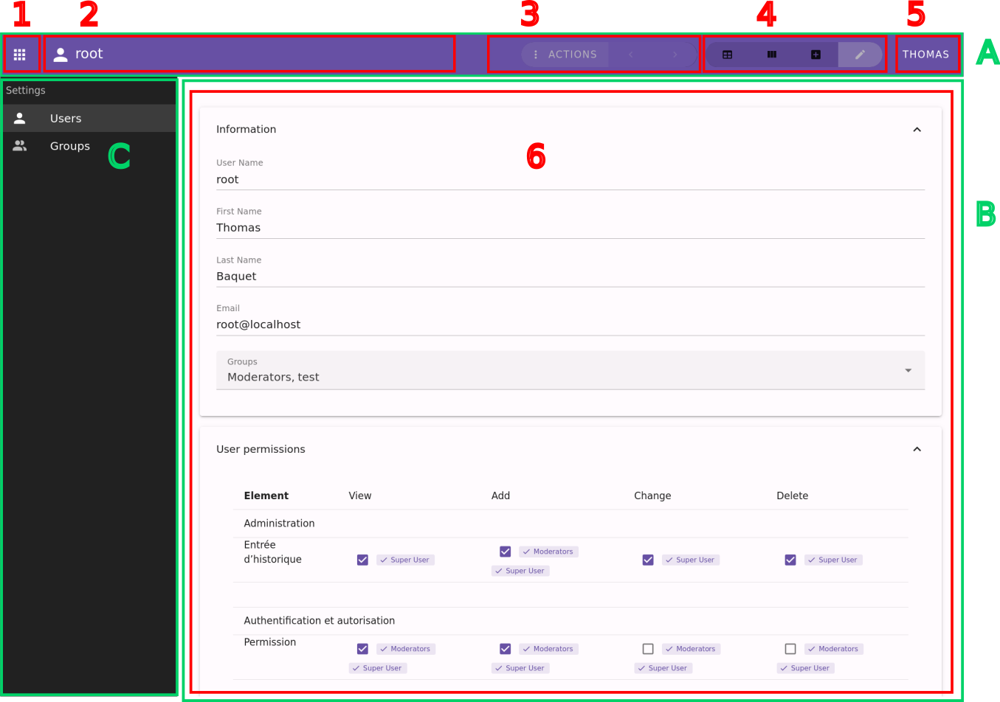

Client Application
==================

Oxylus uses the following frameworks: Vue (composition API), Vuetify, Pinia, Pinia-ORM. A client application is a javascript/typescript Vite project.

The basic project structure looks like this:

.. code-block:: bash

    my-app /
        package.json       # package information
        tsconfig.js
        vite.conf.js       # vite project configuration
        src /              # source
            app.ts         # Vue application if it needs to be extened
            index.ts       # entry point: creates Vue application
            sfc.ts         # entry point: single file components
            models.ts      # pinia-orm models definition
            composables /  # vue composabls
            components /   # vue components
        tests /            # tests
        node_modules /     # created when installing dependencies

Note: the ``django-admin assets`` command can be used in order build the project.

The goal of the client application is to provide an interface to the end-user. This throws multiple requirements:

- user interface:

    - this is handled by Vue and Vuetify;
    - integrated into Oxylus framework: this is the ``ox`` libraries;

- manipulate objects from the backend:

    - modelize and handle data: using ``pinia-orm`` models
    - synchronization with the server through API: (``@pinia-orm/axios`` in conjunction with ``rest_framework`` on the backend)

- quality: tests integration

The goal of the Oxylus layer is to make this integration happens, by providing for the assets a set of components and composables.

Application Layout
------------------

The client application provide the following layout using ``OxApp`` component. The screenshot is of a model panel (``OxUserPanel``).

- **A**: top bar, providing quick access and navigation
- **B**: all panels displaying only the current one. A panel can provide multiple views [6]
- **C**: applications menu (which can be hidden by button [1]
- **1**: button to show/hide applications menu
- **2**: current panel's title and icon
- **3**: current panel's actions
- **4**: current panel's views navigation buttons
- **5**: user menu
- **6**: current panel's content or view

Panels
......

The client interface is composed of multiple panels which represent a specific use case. Panels are provided by applications and can be sub-divised into multiple views. The base component for panels is ``OxPanel``, which is extendable by its slots.
As an example, a common case is to provide CRUD for models, which is what does ``OxModelPanel``: it provides views for listing (with search and filtering facilities), edition and creation.

Panels and nested views are named, and accessible through their path. A panel has a default view falling back to ``list.tables`` when none is provided (it can be configured through component's attribute ``view``).

Here is a simple example of a panel:

.. code-block:: xml

    <ox-panel name="login" :title="Login" :icon="mdi-account">
        <template #append-title>
            <!-- this goes in the top bar at the right -->
        </template>
        <template #default>
            <!-- this goes in the main content -->
            <ox-login/>
        </template>
    </ox-panel>

Another example with a model panel, taken from the ``OxUserPanel`` used for users management. For more detailed usage, please look at the ``OxModelPanel``
documentation.

.. code-block:: xml

    <ox-model-panel :name="props.name" :tabbed="props.tabbed"
            :repo="repos.users"
            :headers="props.headers"
            :relations="props.relations"
            search="search">
        <!-- forward slots to the inner component -->
        <template v-for="name in forwardSlots" :key="name" #[name]="bind">
            <slot :name="name" v-bind="bind"/>
        </template>

        <template #list.filters="{list,filters}">
            <!-- example extending list filters -->
            <v-select class="ml-3" density="compact"
                v-model="filters.groups__id__in" multiple
                label="Groups"
                :items="groups" item-title="$title" item-value="id"
                hide-details />

            <slot name="list.filters" :list="list" :filters="filters"/>
        </template>

        <template #item.groups="{item}" v-if="!slots['item.groups']">
            <!-- list item slot used to display groups -->
             <v-chip color="primary" v-for="group of item.groups" variant="tonal" class="mr-2">
                 {{ group.name }}
             </v-chip>
        </template>

        <template #views.list.kanban="{panel,items,list}">
            <!-- add kanban list view which is not provided by default on OxModelPanel -->
            <ox-list-kanban :items="items" field="groups_id" :headers="kanbanHeaders"
                item-title="username"
                @click="(item) => panel.reset('.edit', item)"/>
        </template>

        <template #views.add="{value,saved}"
               v-if="!slots['views.add'] && context.user.can('auth.add_user')">
            <!-- creation view, displayed only if user has the permission and slots has not already been provided. -->
            <ox-user-edit :initial="value" @saved="saved"/>
        </template>

        <template #views.edit.window.default="{value}"
                v-if="context.user.can('auth.change_user')">
            <!-- edit view -->
            <ox-user-edit :initial="value"/>
        </template>
    </ox-model-panel>

Views
.....

A panel may contains multiple views. In such case, navigation buttons are displayed in the top bar. Views can provide actions shown next to it.

Views are put in a different slot each named as ``views.[name]``. The ``[name]`` will be used as view name (which is used in paths).

``OxModelPanel`` provides default set of actions based on this name, for thoses starting with ``list.`` and ``detail.``. Note that the prefix is included as view name, such as ``list.table`` for slot ``views.list.table``.

Path & Navigation
.................

The panel navigation is handled using ``path`` and ``href`` options.

- **path**: path targets the actual panel (and optional view), following the convention ``[panel](.[view])?``. This way, ``user-panel`` will targets default view of the user model panel, while ``user-panel.edit`` will target the edit view.

  The ``OxApp`` provide the ``panel`` object, which is used to reset and assign a current value to panels among other things. The method ``reset(path, value?, options?)`` will reset panel to the provided argument. ``path`` can be relative in order to target views of the current panel. Calling ``reset('.list.table')`` will show the ``list.table`` view of the current panel (note: list views names starts with the ``list.`` prefix). Calling ``reset('group-panel.list.table)`` targets the view ``list.table`` of the ``group-panel`` panel.

- **href**: it provides page url to access to the panel. It is used in order to be able to load panels and views on other pages. When ``reset`` is called with this option, it will check whether the page needs to be reloaded. If so, it will do this, providing ``panel`` GET parameter targetting the actual panel and view.

Interface integration
.....................

Panel and view title and navigations will be rendered in the top bar. A view can also provide extra actions and buttons there, such as showing
list filters. Note: filters are available for all list views, while the list itself is handled by the model panel component.

Panels can have a provided state which will be rendered when required (such as processing API request, or error display).

Models
------

Actions
-------

Actions are buttons that can execute a specific behaviour. It checks user's permission in order to execute, and can display in two different ways: as select list item, or as a button.
