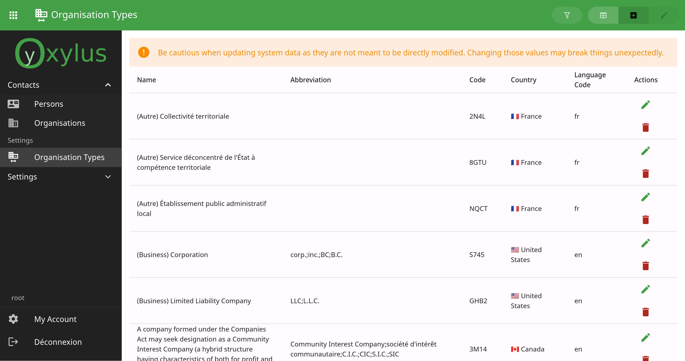
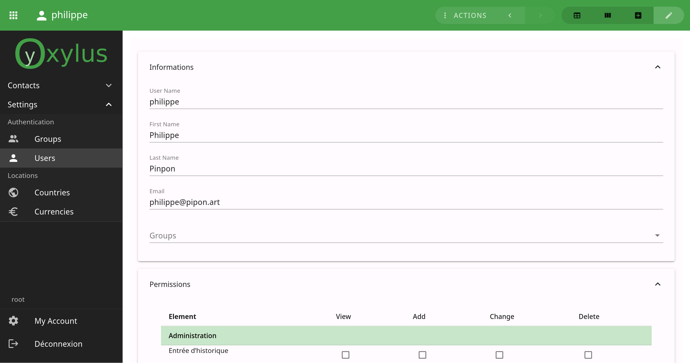

Oxylus
======

Oxylus is a web platform and framework focused on providing a back-office integrating the needs
of companies and institutions. It aims to offer a versatile platform that can be reused for custom
tools and development.

A lot of tools are domain specific (eg. blogging, eshop, administration, monitoring). Oxylus is a
home for all of them, and even more: anyone can reuse it.

It provides common toolz out-of-the-box, such as user management, user settings and contacts. Later
on the way, more will come.

Documentation
-------------

.. toctree::
   :maxdepth: 2

   guide
   api
   project

Why do we need Oxylus?
----------------------

When it comes for enterprise to develop or use IT tools, they have multiple choices: using an already
existing solution (FLOSS, or proprietary licensed ones), or do things at home. This last choice
often leads to custom spaghetti code that costs a lot in term of development and technical debt.

Part of it is the lack of a framework that segregates the main layout and workflow to domain specific
ones. It also leads at the start of a project to reinvent the wheel, with a high probability of
refactoring what should have been trivial regarding the overall project.

This is where Oxylus enters into action. It provides a framework that integrate custom applications
into a single interface, while being domain agnostic. This means:

- Reduce the amount of work: no need to worry about creating a complete layout and fullstack integration.
- Exploit extensibility and reusability: we want to develop reusable applications, by sharing and mutualize
  efforts towards a digitalized world. Technology should be affordable to anyone: *lets do it*.
- Ensure quality product: by ensuring a quality we reduce costs due to bugs and lack of documentation.
  We want clear and complete documentation to anyone. We want quality. We provide a methodology over a
  product development workflow.

Project orientation
-------------------

There is a huge gap of comprehension between technical and non-technical users. The project here aims
to reduce this gap at its level: being comprehensive and accessible to both parts.

- Taking in account end-user experience;
- Document development process as well as the tools used;
- Provide a working methodology;
- Follow best practices and deliver quality product;

Technicaly speaking, we provide a stack relying on the power of well known and tested
existing frameworks. It integrates the power of Django (on the backend) with Vue's one
(on the frontend).

It allows integrating cutting edge technologies, notably in domain of AI while make it
accessible to small companies and groups of people.

Core Principles
---------------

Oxylus follows thoses principles:

**0. Follow good practices:**

Humanly: *respect people* .

Technically: analyze, methodology, testing. It takes time to make good engineering. Stay simple, don't try to do everything at once: it is better to have less but working features.

**1. Develop modern web applications:** offer reactive and user experience oriented interfaces.

Technically speaking, use a web full stack using for backend the power of Django. Client-side take profit of the amazingness of Vue and related tools.

Each application systematically provided with:

    - Backend-side: application configuration, API (client), serializers, application view, other backend specifics;
    - Client side: Vue based Vite project, models, API (client);

We must enlight here some frontiers as they may be blur:

    - When a part of the interface requires some logic, behavior, widgets they must be encapsulated client-side.
    - In order to allow extensibility over templates rendering there still might be an equivalent as django's template.
    - Translation handling is kept under the respective owner of the text (backend or frontend).
